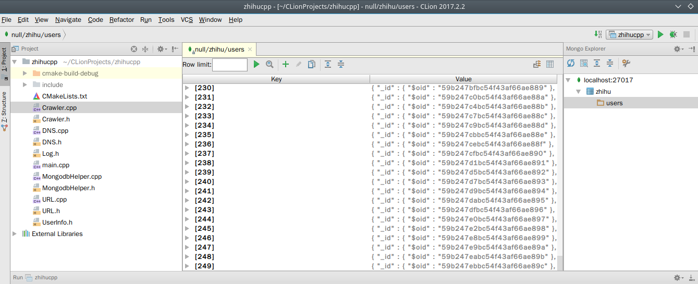
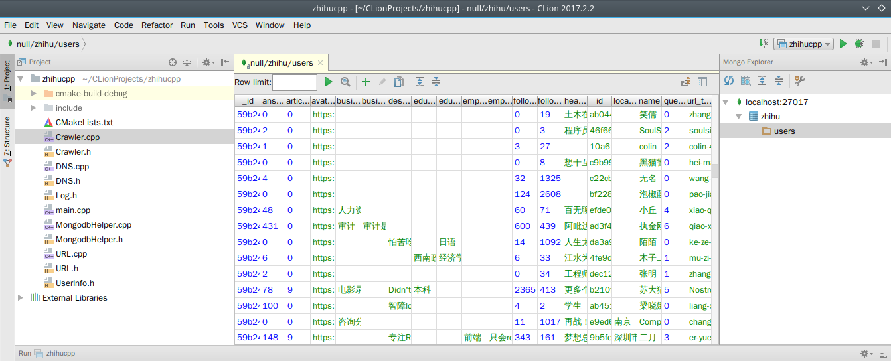

# zhihucpp

## 介绍

这是一个用c++ 写的知乎用户爬虫。 直接抓取知乎的Json数据，所以没有使用Post访问，直接使用Get获取数据。

## 依赖

- RapidJSON （由于直接将头文件导入，所以用户不需要自己下载）

- MongoDB

- mongo-cxx-driver

## 使用
直接将该工程下载下来

`git clone git@github.com:outdoMortalHu/zhihucpp.git`

使用CLion打开该项目 `Shift + F10`

## 输出

所有的数据都在MongoDB 的 zhihu 下的users

## 待完成

- IP代理

- 增加通过获取关注了列表来爬取用户信息

## 更多

- 由于知乎限制ip访问频率，为了防止ip限制加上了usleep()强行降低ip访问频率

## 作者信息

- 邮箱： outdoMortalHu@outlook.com

